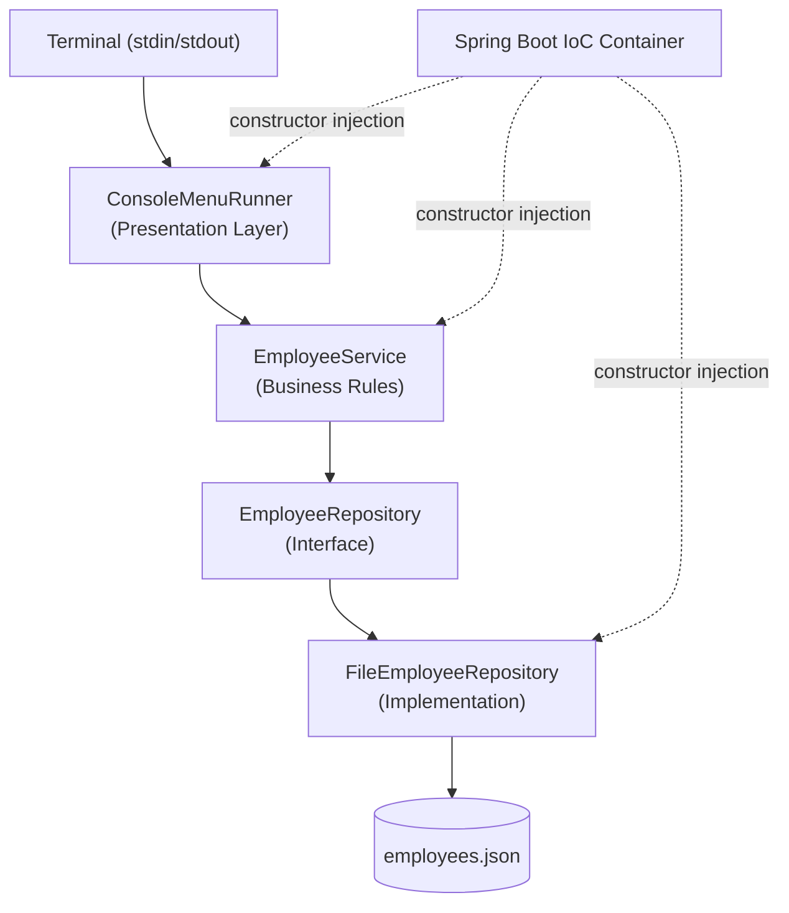

# Employee Management System


Employee Management System is a command-line application for managing employee records: adding, listing, searching, updating, and removing employees through a text-based menu.

It is built with Java 17 and Spring Boot 3.3.5, organized into separate layers for presentation, business rules, and persistence. Employee data is validated in the domain model and stored in a local JSON file.

## Features

- **Console menu** — add, list, search, update, and remove employees through a text-based menu
- **Domain validation** — name, position, and department cannot be blank; email must match a valid format; salary cannot be negative
- **Business rules** — duplicate email addresses are rejected (case-insensitive); updates and removals on unknown IDs are rejected
- **JSON file persistence** — employees are loaded on startup and saved after every change, using Jackson
- **Layered architecture** — domain, repository, service, and presentation layers are decoupled through interfaces
- **Dependency injection** — wired with Spring Boot (`@Service`, `@Repository`, `@Component`, constructor injection)
- **Typed exceptions** — specific exception types instead of generic runtime exceptions
- **Unit tests** — covering the domain model, repository, and service layers

## Architecture



Each arrow from `EmployeeService` downward is a dependency on an interface, not a concrete class: `EmployeeService` depends on `EmployeeRepository`, never on `FileEmployeeRepository` directly. Replacing JSON file storage with a database means writing a new `EmployeeRepository` implementation; nothing above the repository layer changes.

## Folder Structure

```
EmployeeManagementSystem/
├── src/
│   ├── main/
│   │   ├── java/com/pedrodias/
│   │   │   ├── app/            # Application entry point and console menu (presentation layer)
│   │   │   │   ├── Main.java
│   │   │   │   └── ConsoleMenuRunner.java
│   │   │   ├── model/          # Domain model — immutable, self-validating
│   │   │   │   └── Employee.java
│   │   │   ├── repository/     # Persistence layer (interface + JSON file implementation)
│   │   │   │   ├── EmployeeRepository.java
│   │   │   │   ├── FileEmployeeRepository.java
│   │   │   │   └── EmployeeRecord.java
│   │   │   ├── service/        # Business rules and use cases
│   │   │   │   └── EmployeeService.java
│   │   │   └── exception/      # Custom exception hierarchy
│   │   │       ├── EmployeeManagementException.java
│   │   │       ├── EmployeeNotFoundException.java
│   │   │       ├── DuplicateEmployeeException.java
│   │   │       ├── InvalidEmployeeDataException.java
│   │   │       └── EmployeeStorageException.java
│   │   └── resources/
│   │       └── application.properties
│   └── test/
│       └── java/com/pedrodias/
│           ├── model/          # Employee validation tests
│           ├── repository/     # File persistence tests
│           └── service/        # Business rule tests
├── pom.xml
└── README.md
```

| Layer | Responsibility |
|---|---|
| `app` | Boots Spring, runs the console loop, and translates menu input into service calls |
| `model` | `Employee`, the domain object — validates its own fields when constructed |
| `repository` | `EmployeeRepository` interface and its JSON file implementation |
| `service` | Business rules: email uniqueness and existence checks before update or delete |
| `exception` | Typed exceptions used in place of generic `RuntimeException` |

## Technologies

| Technology | Purpose |
|---|---|
| [Java 17](https://openjdk.org/projects/jdk/17/) | Language and runtime |
| [Spring Boot 3.3.5](https://spring.io/projects/spring-boot) | Dependency injection and application bootstrap (no web server is started) |
| [Maven](https://maven.apache.org/) | Build and dependency management |
| [Jackson](https://github.com/FasterXML/jackson) | JSON serialization for file-based persistence |
| [JUnit 5](https://junit.org/junit5/) | Unit testing |

## Quick Start

### Prerequisites

- [JDK 17](https://adoptium.net/) or later
- [Maven 3.9+](https://maven.apache.org/download.cgi)

### 1. Clone the repository

```bash
git clone https://github.com/pedrordias6/EmployeeManagementSystem.git
cd EmployeeManagementSystem
```

### 2. Build

```bash
mvn clean package
```

### 3. Run

```bash
mvn spring-boot:run
```

Or run the packaged jar directly:

```bash
java -jar target/EmployeeManagementSystem-1.0-SNAPSHOT.jar
```

### 4. Use the menu

```
=== Employee Management System ===
1. Add Employee
2. List Employees
3. Search Employee
4. Update Employee
5. Remove Employee
6. Exit
Choose an option:
```

### 5. Run the tests

```bash
mvn test
```

### Configuration

Employee data is persisted to `employees.json` in the working directory by default. The file path can be overridden in `application.properties`:

```properties
employee.storage.file-path=employees.json
```

## Performance Notes

At the current scale — an in-memory map backed by a JSON file — the design favors simplicity over optimization:

- Email-uniqueness checks scan every employee (`O(n)`) on each add or update. This is fine for file-based storage and would be the first thing to replace with an indexed query if `EmployeeRepository` were backed by a database.
- The entire employee list is rewritten to disk on every mutation, so the JSON file always matches in-memory state. The trade-off is write amplification, which is acceptable for a single-user console tool.
- `Employee` is immutable, so it can be read or shared without defensive copying.

## Roadmap

**Completed**
- [x] In-memory prototype with domain validation
- [x] JSON file persistence via Jackson
- [x] Spring Boot dependency injection
- [x] Custom exception hierarchy
- [x] Unit tests for the model, repository, and service layers

**Next**
- [ ] REST API (Spring Web)
- [ ] Relational database persistence (PostgreSQL or H2, via Spring Data JPA)

**Future**
- [ ] Pagination and filtering
- [ ] Authentication and role-based access control
- [ ] Docker packaging
- [ ] CI pipeline (GitHub Actions)
- [ ] Web or desktop front end

## License

Distributed under the MIT License. See [LICENSE](LICENSE) for details.

---

Author: [Pedro Dias](https://github.com/pedrordias6)
